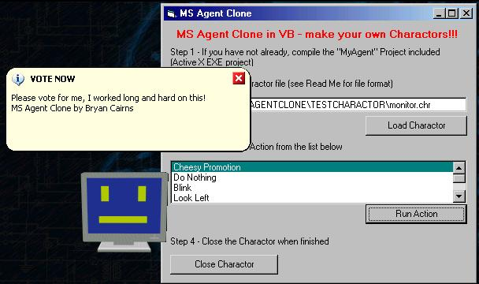



## MS Agent Clone \- A MUST SEE

### Description

This is an MS Agent Character Clone!

Now you can make your own charactors and animate them.

This supports sound playing, "balloon" style text, and image shaped forms. AND MUSH MORE!

Please Vote or at least comment, I worked long and hard on this.
 
### More Info
 
See "ReadMe.txt" in zip file for compiling instructions!!!

             |
---                |---
**Submitted On**   |2002-03-08 00:06:52
**By**             |[Bryan A\. Cairns](https://github.com/Planet-Source-Code/PSCIndex/blob/master/ByAuthor/bryan-a-cairns.md)
**Level**          |Intermediate
**User Rating**    |4.9 (83 globes from 17 users)
**Compatibility**  |VB 5\.0, VB 6\.0
**Category**       |[Complete Applications](https://github.com/Planet-Source-Code/PSCIndex/blob/master/ByCategory/complete-applications__1-27.md)
**World**          |[Visual Basic](https://github.com/Planet-Source-Code/PSCIndex/blob/master/ByWorld/visual-basic.md)
**Archive File**   |[MS\_Agent\_C60332382002\.zip](https://github.com/Planet-Source-Code/bryan-a-cairns-ms-agent-clone-a-must-see__1-32445/archive/master.zip)

